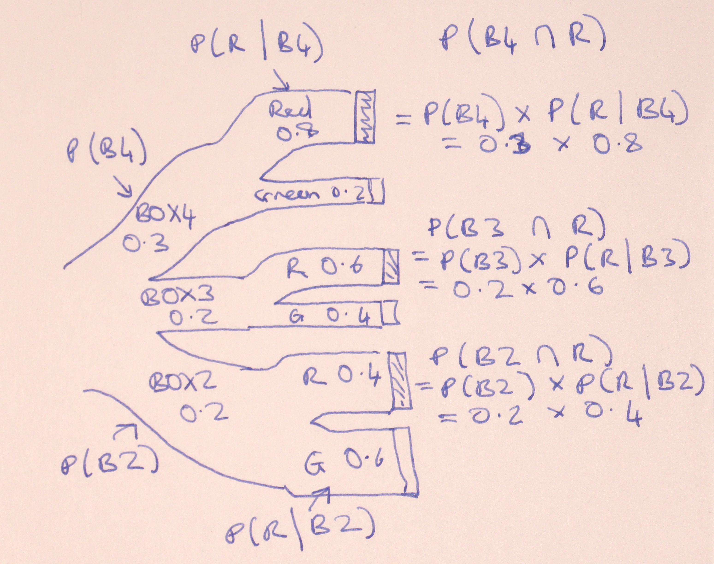

---
jupyter:
  jupytext:
    notebook_metadata_filter: all,-language_info
    split_at_heading: true
    text_representation:
      extension: .Rmd
      format_name: rmarkdown
      format_version: '1.2'
      jupytext_version: 1.8.2
  kernelspec:
    display_name: Python 3
    language: python
    name: python3
---

# Bayes and bars

```{python tags=c("hide-cell")}
# Run this cell; do not change it.
import numpy as np
import pandas as pd
pd.set_option('mode.chained_assignment', 'raise')
# Make printing of numbers a bit neater.
np.set_printoptions(precision=4, suppress=True)
import matplotlib.pyplot as plt
# Make the plots look more fancy.
plt.style.use('fivethirtyeight')
```

The [reverse probability page](first_bayes) has a game, that we analyzed by
simulation, and then by reflection.

The game is:

* I have two boxes; *BOX4* with 4 red balls and 1 green ball, and *BOX2* with
  two red balls and three green balls.
* I offer you one of these two boxes at random, but with a 30% chance of
  getting BOX4 and a 70% chance of getting BOX2.
* You draw a ball at random from the box, and you get a red ball.
* What is the probability that I gave you BOX4?

We found by simulation, and later by [reflection and
calculation](bayes_theorem), that the probability is around 0.462.

The [Bayes theorem page](bayes_theorem) described the logic we discovered, but
we can also write this on a Sankey diagram:


Here's the calculation for the two boxes:

```{python}
p_box4 = 0.3  # P(B4)
p_box2 = 0.7  # P(B2)
p_red_given_box4 = 0.8  # 4/5; P(R | B4)
p_red_given_box2 = 0.4  # 2/5; P(R | B2)
p_box4_and_red = p_box4 * p_red_given_box4  # P(B4 and R)
p_box2_and_red = p_box2 * p_red_given_box2  # P(B2 and R)
p_red = p_box4_and_red + p_box2_and_red  # P of any way of getting red.
p_box4_given_red = p_box4_and_red / p_red

print('Probability I gave you BOX4, given you drew a red ball:')
p_box4_given_red
```

## Three boxes

Now make the game just slightly more complicated, by adding the option of
another box, BOX3.  BOX3 has three red balls and two green balls, giving a 60%
chance we will draw a red ball from BOX3.

```{python}
p_red_given_box3 = 0.6
```

Now let's say that there's a 20% chance of BOX2, and a 50% chance of BOX2:

```{python}
p_box4 = 0.3  # 30% chance of BOX4
p_box3 = 0.2  # 20% chance of BOX3
p_box2 = 0.5  # 50% chance of BOX2
```

Now, what is the chance that I gave you BOX4, if you know you have drawn a
red?

We could do that by simulation, but let's leap straight to calculation, using the same logic as above.

We really like our Sankey diagrams, so we start with that:



We now have three ways of getting red — from BOX4, BOX3 or BOX2.  The chances
of *both* red and the given boxes is now:

```{python}
p_box4_and_red = p_box4 * p_red_given_box4  # P(B4 and R)
p_box3_and_red = p_box3 * p_red_given_box3  # P(B3 and R)
p_box2_and_red = p_box2 * p_red_given_box2  # P(B2 and R)
```

The overall probability of red on any one trial is the sum of the probabilities of red with each of the three boxes:

```{python}
p_red_3_box_game = p_box4_and_red + p_box3_and_red + p_box2_and_red
p_red_3_box_game
```

The probability I gave you BOX4, given you got a red ball, is the probability
of BOX4 *and* red, divided by the probability of red from any box (above):

```{python}
p_box4_given_red_3_box = p_box4_and_red / p_red_3_box_game

print('Three box version of game')
print('Probability I gave you BOX4, given you drew a red ball:')
p_box4_given_red_3_box
```

## Three boxes, in arrays

The three box version of the game might have prompted you to think that we are doing similar calculation on several values.  You might have thought of putting the various probabilities into arrays, to do the calculation.

Let us do that, for the three box version of the game.

```{python}
# Array version of the 3 box calculation
# Probabilities of boxes 4, 3, and 2.
p_boxes = np.array([0.3, 0.2, 0.5])
# Probabilities of red given boxes 4, 3, 2
p_red_given_boxes = np.array([0.8, 0.6, 0.4])
```

Now we use our arrays to calculate the probabilities of the various boxes
*and* red:

```{python}
p_boxes_and_red = p_boxes * p_red_given_boxes
p_boxes_and_red
```

The probability of red from any box:

```{python}
p_red = np.sum(p_boxes_and_red)
p_red
```

Finally:

```{python}
p_box4_given_red_3_box = p_boxes_and_red[0] / p_red

print('Three box version of game, array calculation')
print('Probability I gave you BOX4, given you drew a red ball:')
p_box4_given_red_3_box
```

In fact, the array version makes it more obvious that we can quickly calculate the probability of any box, given we have drawn a red:

```{python}
print('Probabilities I gave you box4, 3, 2, given red')
p_boxes_and_red / p_red
```

Just for fun, let's do all that in a data frame:

```{python}
boxes_3 = pd.DataFrame()
boxes_3['P(B)'] = p_boxes
boxes_3['P(R given B)'] = p_red_given_boxes
boxes_3['P(B and R)'] = boxes_3['P(B)'] * boxes_3['P(R given B)']
boxes_3['P(B given R)'] = boxes_3['P(B and R)'] / boxes_3['P(B and R)'].sum()
boxes_3.index = ['B4', 'B3', 'B2']
boxes_3
```

## Three boxes, in bars

We can show this array version of the calculation graphically, by using the
length of bars to express the probabilities.

```{python}
boxes_3.plot.barh(subplots=True, legend=False);
plt.subplots_adjust(hspace=0.8)  # Space out the plots a bit.
```

Our inputs are the first two arrays (plots) - $P(B)$ and $P(R | B)$.

The third plot, $P(B \cap R)$, is the first plot multiplied by the second.

The last plot, $P(B | R)$ is the third plot divided by the sum of the third plot.
This means that all the bars get scaled by the same amount; the fourth plot is
just a rescaled version of the third.


## All six boxes

We upgrade the game one more time.

Now say I can hand you any one of *six* possible boxes.  You can guess the
contents of the new boxes.  BOX5 has five red balls and no green balls.  BOX1
has one red ball and four green balls.  BOX0 has five green balls.

This time, there is an equal chance of P=1/6 that I will hand you each type of
box.

Again, you have drawn a red.  What are the chances that I have given you BOX4?
Or indeed, any of the other boxes?

The Sankey diagram gets a little spidery, but we can put all that into the
data frame in the same form as for the three boxes.

```{python}
boxes_6 = pd.DataFrame()
boxes_6['P(B)'] = np.ones(6) * 1/6  # Same probability for each box.
boxes_6['P(R given B)'] = np.array([1, 0.8, 0.6, 0.4, 0.2, 0])
boxes_6['P(B and R)'] = boxes_6['P(B)'] * boxes_6['P(R given B)']
boxes_6['P(B given R)'] = boxes_6['P(B and R)'] / boxes_6['P(B and R)'].sum()
boxes_6.index = ['B5', 'B4', 'B3', 'B2', 'B1', 'B0']
boxes_6
```

```{python}
boxes_6.plot.barh(subplots=True, legend=False);
plt.subplots_adjust(hspace=0.8)  # Space out the plots.
```

Notice that, in this case, where the probability of each box is the same, we
do not really need to calculate the third row, we can just divide the second
row by the sum of the second row.  This is because, when the probability of
each box is the same, scaling the probability does not change the lengths of
the bars relative to each other, so, when we divide each bar by the sum of the
bar lengths, the result is the same.

```{python}
# Same result skipping the multiplication by initial box probabilities.
boxes_6['P(R given B)'] / boxes_6['P(R given B)'].sum()
```

If you do not mind a little basic algebra, see why this must be true in the
[equal initial p](equal_initial_p) page.

## Confidence and boxes

Consider the 6 box probabilities above.

Now consider the following question: You have drawn a red.  What is the
probability that the box contained at least 3 red balls?

From the [addition rule](laws_of_probability), this is the sum of the $P(B |
R)$ probabilities for boxes 3, 4, and 5.

```{python}
p_at_least_3 = (boxes_6.loc['B5', 'P(B given R)'] +
                boxes_6.loc['B4', 'P(B given R)'] +
                boxes_6.loc['B3', 'P(B given R)'])
p_at_least_3
```

You have `p_at_least_3` *confidence* that the box I gave you had at least
three red balls.

This is the logic for *Bayesian confidence intervals*.  These are sometimes
called [credible intervals](https://en.wikipedia.org/wiki/Credible_interval).
We can reason about plausible states of the world that led to our results.  In
our case we can reason about which box we have drawn from (state of the
world), given we have seen a red ball (the result).

Now we are ready to seek confidence for something other than a game.
