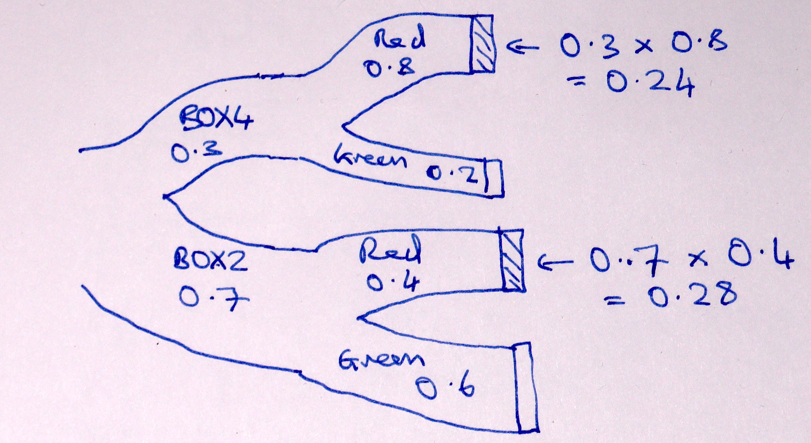
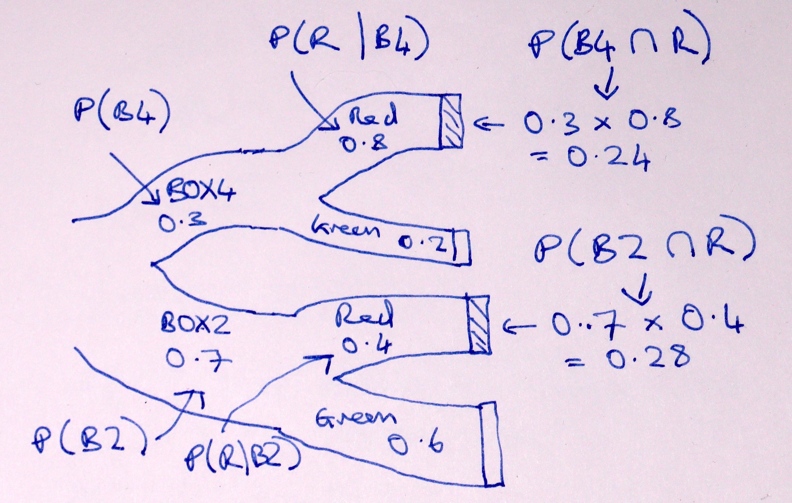

# Bayes theorem

The [reverse probability page](first_bayes) has a game, that we analyzed by
simulation, and then by reflection.

The game is:

* I have two boxes; *BOX4* with 4 red balls and 1 green ball, and *BOX2* with
  two red balls and three green balls.
* I offer you one of these two boxes, with a 30% chance that I give you BOX4,
  and 70% chance I give you BOX2.
* You draw a ball at random from the box, and you get a red ball.
* What is the probability that I gave you BOX4?

We found by simulation, and later by reflection, that the probability is about
0.462.

The logic we discovered was:

* We want the proportion of "red" trials that came from BOX4.
* Calculate the proportion of trials that are *both* BOX4 and red, and divide
  by the overall proportion of red trials.

Here is a Sankey diagram of that calculation:

We found the proportion of red trials that are *both* BOX4 *and* red is (the
proportion of BOX4 trials) multiplied by (the proportion of BOX4 trials that
are red.

In our case above, the value we need is the probability of red trials from BOX4 (red *AND* BOX4) divided by the probability of red from either box.  In our case this is 0.24 / (0.24 + 0.28) = 0.4615.

The logic above is a fundamental rule in probability called [Bayes
theorem](https://en.wikipedia.org/wiki/Bayes'_theorem).

In this page, we relate the logic above to the usual way of describing Bayes
theorem.

First we need some notation.

The probability that I give you BOX4 on any one trial is 0.3.

I could write this out long-hand as "probability of BOX4", but this will soon become inconvenient, so I will write the "probability of BOX4" in a much more compact form as $P(B4)$.   As you remember $P(B4)$ is 0.3:

$$
P(B4) = 0.3
$$

Read this as "the probability of BOX4 is 0.3".

Similarly:

$$
P(B2) = 0.7
$$

The probability of getting a red ball, *given that* I am drawing from BOX4, is
4/5 = 0.8.  Again, we could write that out longhand as "probability of red given BOX4, or:

$$
P(Red\ \mathrm{given}\ BOX4)
$$

but I want to make this more compact.  First I will shorten $\mathrm{red}$ to $R$, and then I will write "given" with the bar: $\mid$.

$$
P(R \mid B4) = 0.8
$$

Read this as "the probability of drawing a red ball given I have BOX4 is 0.8".

Similarly:

$$
P(R \mid B2) = 0.4
$$

"The probability of red given BOX2 is 0.4".

We follow the logic above, with this notation.  Here is the logic again:

1. We want the proportion of "red" trials that came from BOX4.
2. Calculate the proportion of trials that are *both* BOX4 and red, and divide
   by the overall proportion of red trials.

We can express the first statement by saying that we are trying to find $P(B4
\mid R)$ — "the probability of BOX4 given I have drawn a red ball".

Now we need some more notation.  We need the idea of the probability of
getting *both* BOX4 *and* red.  This is the probability for any one trial that
we will end up with a red from BOX4, as opposed to a red from BOX2 or a green
from either box.

We could write this as *and* $P(B4\ \mathrm{and}\ R)$, but in fact, we usually shorten
the *and* to this symbol: $\cap$:

$$
P(B4 \cap R)
$$

Read this as the "probability we got BOX4 and then a red".

We have already found that that we get this probability of BOX4 *and* red by
*multiplying* the probability of BOX4 (0.3) by the probability of — getting
a red ball, *given* BOX4 (0.8).  In our notation, this multiplication is

$$
P(B4 \cap R) = P(B4) * P(R \mid B4)
$$

"The probability of BOX4 *and* red is the probability of BOX4 multiplied by
the probability of — red *given* BOX4".

Remember too, from the [reverse probability page](first_bayes) that we found
$P(R)$ by adding the probabilities of the two different ways we can get a red
ball: $P(R) = P(R \mid B4) + P(R \mid B2)$.

Let's put all that on the Sankey diagram:

Putting the first and second statements together into one, we get:

$$
P(B4 \mid R) = \frac{P(B4) P(R \mid B4)}{P(R)}
$$

This is Bayes theorem, although it is usually written with the multiplication
in the other order:

$$
P(B4 \mid R) = \frac{P(R \mid B4) P(B4)}{P(R)}
$$

See [Bayes theorem on Wikipedia](https://en.wikipedia.org/wiki/Bayes'_theorem)
for more detail.
