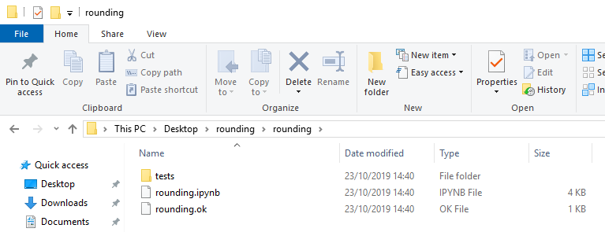
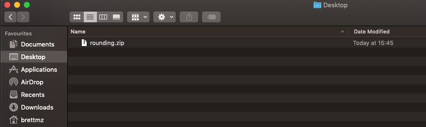

# Extracting exercise archives

Many of your exercises have [OKpy](https://okpy.org) tests, and are in `.zip` files.

This page has instructions for downloading and extracting these zip files so
OKpy tests work as they should.

## On Windows

Right click on the link to the zip file, and select "Save link as..." (for
Chrome and Firefox) or "Save Target As..." on Microsoft Edge.

Save the zip archive to a familiar folder, such as "Desktop".  Prefer a folder that is on your hard drive, rather than one in the cloud; cloud folders can confuse Jupyter.

Once you have saved the file, open Explorer, and navigate to the folder you just saved to.  Find the `.zip` file you just saved.  It will appear as a compressed folder in Explorer, with a zip running through it, if you have an icon view.

Right click on this compressed file, and choose "Extract All...":

Select a folder to extract to.  The default will be to a sub-folder of the
folder you saved the `.zip` archive to, e.g. "Desktop":

Now use Explorer to navigate to the new extracted folder.  You should find a subfolder in the new folder, and in that folder, you will find a notebook (file name ending in `.ipynb`), a test configuration file (file name ending in `.ok`) and a `tests` sub-folder, with various `.py` test files inside:

Open the notebook in Jupyter, and you are ready to go.

## On Mac

Right click on the link to the zip file, and select "Save link as..." (for
Chrome and Firefox) or "Download Linked File As..." on Safari.

Save the zip archive to a familiar folder, such as "Desktop".  Prefer a folder that is on your hard drive, rather than one in the cloud; cloud folders can confuse Jupyter.

Once you have saved the file, open Finder, and navigate to the folder you just saved to.  Find the `.zip` file you just saved.  If you have Finder configured to use icon view, it may appear as a compressed folder,  with a zip running through it.  In list view, it will appear as a `.zip` file:

Right click on this compressed file, and choose "Open With" and "Archive
Utility".

The archive will extract to a sub-folder of the folder you saved the `.zip`
archive to, e.g. "Desktop":

Now use Finder to navigate to the new extracted folder.  You should find
a find a notebook (file name ending in `.ipynb`), a test configuration file
(file name ending in `.ok`) and a `tests` sub-folder, with various `.py` test
files inside:

Open the notebook in Jupyter, and you are ready to go.
